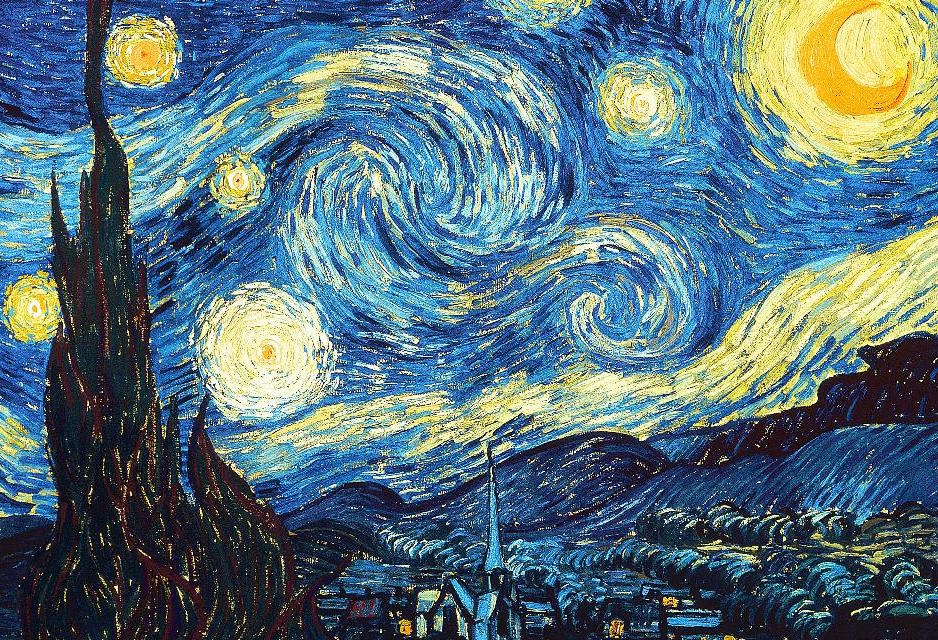

# Neural_Fast_Style_Transfer_with_Tensorflow
For studying Neural Style Transfer

## Original papers

https://cs.stanford.edu/people/jcjohns/papers/eccv16/JohnsonECCV16.pdf

## Original code

https://github.com/jcjohnson/fast-neural-style

## Reference code

https://github.com/antlerros/tensorflow-fast-neuralstyle

https://github.com/machrisaa/tensorflow-vgg

## Reference site

http://cocodataset.org/#home

## Environment

python = 3.6.8

tensorflow =1.13.1

opencv-python=3.4.2

numpy = 1.16.1

## How To Use It?

1. Go to tensorflow-vgg git, and make sure them run(I use VGG-19 and pretrained with imagenet)

2. Go to Ms-COCO Web Site and download COCO-Dataset 2014(because of use to training)

3. Modify some code in train.py and train_ori.py

  3.1. train.py : line 13 ~ 16

  3.2. train_ori.py : line 13 ~ 16
  
4. Run train.py or train_ori.py

## Result Example

Result of train.py running 1epoch with all data

 </img>
 </img>
 </img>

Result of train_ori.py running 1epoch and 18500step with all data

 </img>
 </img>
 </img>

## Differences from the original

Convolution kernel size 4 instead of 3.

Training with batchsize(n >= 2) causes unstable result.

minibatch with 1

Feature Loss calculate with 4 layers

## What differences of two code

train_ori.py is the code you created like the original thesis. But I have not yet find an example of the original thesis so, I couldn't check the exact same 

train.py is the code that recreates the above reference code in its own way using layers of tensorflow.
